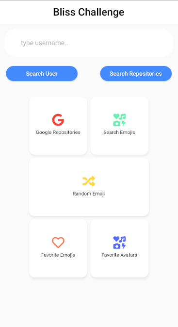
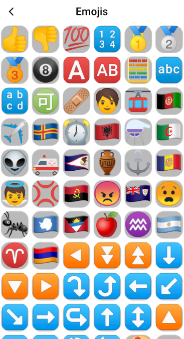
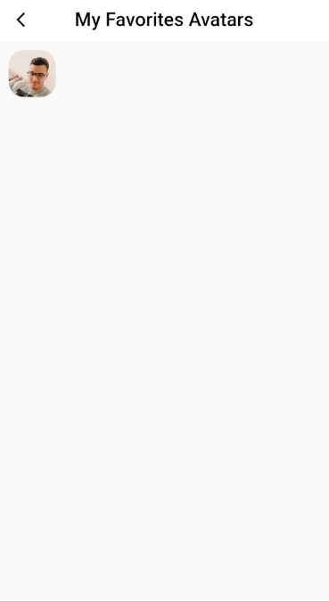

# bliss_challenge

A new Flutter application.

## Getting Started

This project is a starting point for a Flutter application.

The Project Runs in Flutter 2.0, as you can see in the yaml file I changed and added dependency_overrides
to fix some bugs from packages because some of it are not 100% for use in flutter 2.0, so that it was how I fixed to use it.
Just get notice if you use the Chrome web emulator the shared preferences will not work cause still not implemented on web Emulator.

Dependencies:
  bloc_pattern: State management system.
  get: In this project it's used for Navigation but can be used as State management as well.
  http: API for HTTP requests.
  flutter_screenutil: Plugin for adapting screen.
  flutter_form_builder: Helps in creation of forms.
  shared_preferences: In this project is used to save data in cache.

Application Work Flow.

 To add a Avatar just search for a User profile and click in the Image now you can go to the Fav Avatar Screen
 and there you can delete from the list :).

 Adding a Emoji is pretty much the same flow, and in the Favorite Emoji Screen you can remove from your list.

 Searching google Repositories it is pretty simple, just click in the 'Search repo google buttom.'

  
